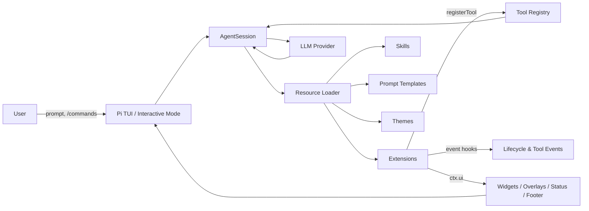
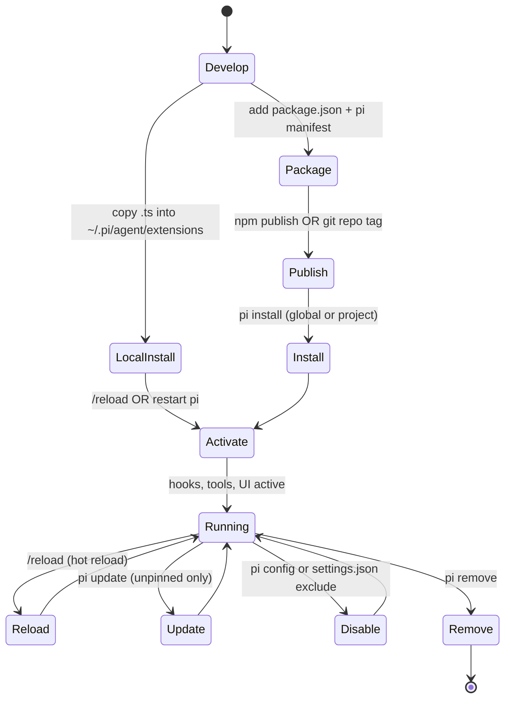
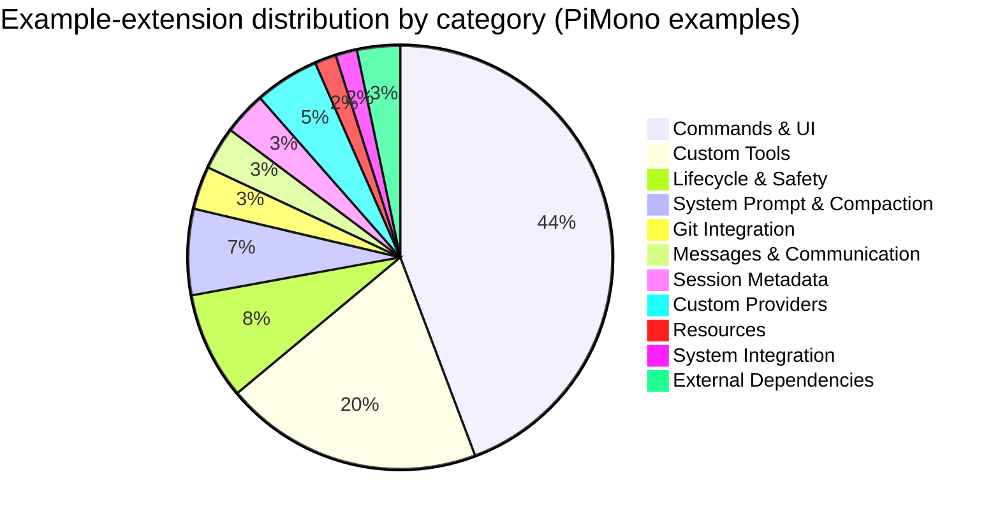

# PiMono Extensions Deep Research Report

## Executive Summary

PiMono’s coding-agent (“pi”) implements an unusually powerful extension system: an “extension” is a TypeScript module loaded at runtime (no build step required) that can subscribe to lifecycle events, register new LLM-callable tools, add `/slash` commands, and render custom UI inside the terminal (TUI). citeturn22view0

The ecosystem has grown into a package-driven model. “Pi packages” bundle extensions, skills, prompt templates, and themes for distribution via entity["company","npm","javascript package registry"] or git. Packages can declare resources via a `pi` manifest in `package.json` (or use conventional directory names), and can be enabled/disabled at global or project scope. citeturn38view1turn15view1turn22view0

As of early March 2026, npm keyword search indicates **hundreds of community packages** tagged `pi-package` (a recent snapshot shows **724 packages** found). citeturn33search24turn38view1 The official package gallery exists (pi.dev / buildwithpi.ai), but during this research it repeatedly reported it could not reach the npm registry, so this report relies on (a) the canonical PiMono docs and example repos, and (b) independently-accessible package indices and original repositories. citeturn24view0turn20search10

Assumptions (explicit): “PiMono extensions” is interpreted as **pi-coding-agent extensions and Pi packages** authored for PiMono’s coding agent, not browser extensions or unrelated “Pi” ecosystems.

## Ecosystem Structure and Extension Types

Pi’s official documentation defines extensions as TypeScript modules that can (among other things) register tools, intercept events, prompt the user via a UI API (`ctx.ui`), and persist state into the session log. Extensions are loaded via `jiti`, which is why TypeScript works without precompilation. citeturn22view0

image_group{"layout":"carousel","aspect_ratio":"16:9","query":["pi coding agent terminal UI screenshot","pi-mono pi.dev logo","pi extension mermaid ASCII screenshot","pi sandbox extension screenshot"],"num_per_query":1}

### Core extension capabilities

The “extensions” spec lists several capability clusters that map cleanly to extension “types” in the wild:  
- **Skill modules** (instructions + optional tools) and **prompt templates** (Markdown expansions) as lightweight “capability bundles.” citeturn16search18turn15view1  
- **Tool integrations** via `pi.registerTool()` (LLM-callable) and event interception (`tool_call`, `tool_result`, etc.). citeturn22view0  
- **UI plugins** via `ctx.ui`: notifications, confirms/selects, widgets/status/footer/header, custom components, and overlays (including in RPC mode). citeturn22view0turn18search8turn15view0  
- **Session and workflow orchestration**: intercepting session switching/forking/compaction, naming sessions, bookmarking tree nodes, and storing persisted state in session entries. citeturn22view0turn27view0  
- **Integrations and providers**: packages and examples exist for custom providers, web browsing/search, and external system bridges. citeturn27view0turn15view2

### Architecture and workflow diagrams



This reflects the published lifecycle: user input is processed with extension-command dispatch, skill/template expansion, then the agent loop emits events for turns, tools, and sessions, all of which extensions can intercept. citeturn22view0



Hot reload is explicitly supported for extensions placed in the auto-discovered locations and reloaded via `/reload`. citeturn22view0turn16search16  
Package updating behavior is governed by pinning: versioned npm specs and git refs are “pinned” and skipped by `pi update`. citeturn38view1

## Extension Catalog

### Methodology and limits

1) **Official reference set**: PiMono’s own `packages/coding-agent/examples/extensions/` directory lists many canonical extensions with descriptions and usage patterns. citeturn27view0turn25view0  
2) **Community package universe**: Pi’s package system relies on the `pi-package` keyword for discoverability, and npm search snapshots show hundreds of packages. citeturn38view1turn33search24  
3) **Metrics**: Where packages have a dedicated repo page, GitHub stars, license, and release recency are taken from the original repositories. citeturn39view0turn39view1turn39view2turn12view2turn29view0turn28view0  
4) **Downloads**: The official gallery (pi.dev) was intermittently unreachable from this environment, and many npm package pages were access-limited. For comprehensive download counts, use the reproducible approach described in the Developer Manual (npm downloads API). citeturn24view0turn23search21

### Catalog of official PiMono example extensions

These are shipped as examples in the PiMono repo (not separately published), and are valuable as “reference implementations” for extension authors. citeturn27view0turn25view0

| Name (example) | Description (official) | Primary function | Typical use cases | Repo / location | Stars / downloads | License | Last update |
|---|---|---|---|---|---|---|---|
| `permission-gate.ts` | Confirms before dangerous bash commands (`rm -rf`, `sudo`, etc.) citeturn27view0 | Safety gate | Prevent destructive shell actions | PiMono examples/extensions citeturn27view0 | N/A (bundled example) | Follows PiMono repo license citeturn17search5 | Tracks PiMono mainline |
| `protected-paths.ts` | Blocks writes to protected paths (`.env`, `.git/`, `node_modules/`) citeturn27view0 | Write protection | Secret protection, repo hygiene | PiMono examples/extensions citeturn27view0 | N/A | PiMono repo license citeturn17search5 | Tracks PiMono mainline |
| `confirm-destructive.ts` | Confirms destructive session actions (clear, switch, fork) citeturn27view0 | Session safety | Prevent accidental `/new`, `/resume`, `/fork` mistakes | PiMono examples/extensions citeturn27view0 | N/A | PiMono repo license citeturn17search5 | Tracks PiMono mainline |
| `dirty-repo-guard.ts` | Prevents session changes with uncommitted git changes citeturn27view0 | Workflow guard | Avoid losing context while working dirty | PiMono examples/extensions citeturn27view0 | N/A | PiMono repo license citeturn17search5 | Tracks PiMono mainline |
| `sandbox/` | OS-level sandboxing with per-project config citeturn27view0turn32search9 | Isolation / permissions | Constrain file/network access | PiMono examples/extensions/sandbox citeturn27view0turn32search9 | N/A | PiMono repo license citeturn17search5 | Tracks PiMono mainline |
| `todo.ts` | Todo tool + `/todos` + custom rendering + persistence citeturn27view0 | Workflow tool | Track tasks inside session; stateful tools | PiMono examples/extensions citeturn27view0 | N/A | PiMono repo license citeturn17search5 | Tracks PiMono mainline |
| `tool-override.ts` | Override built-in tools (e.g., logging/access control) citeturn27view0 | Tool wrapping | Enforce policies; capture telemetry | PiMono examples/extensions citeturn27view0 | N/A | PiMono repo license citeturn17search5 | Tracks PiMono mainline |
| `dynamic-tools.ts` | Register tools at startup/runtime; prompt snippets/guidelines citeturn27view0turn19search21 | Dynamic capabilities | On-demand tool creation; environment-dependent tooling | PiMono examples/extensions citeturn27view0turn19search21 | N/A | PiMono repo license citeturn17search5 | Tracks PiMono mainline |
| `built-in-tool-renderer.ts` | Custom compact rendering for built-in tools citeturn27view0 | UI / rendering | Reduce noise; improve readability | PiMono examples/extensions citeturn27view0 | N/A | PiMono repo license citeturn17search5 | Tracks PiMono mainline |
| `minimal-mode.ts` | Minimal tool rendering / collapsed output citeturn27view0 | UI / rendering | “Just the calls” display for focus | PiMono examples/extensions citeturn27view0 | N/A | PiMono repo license citeturn17search5 | Tracks PiMono mainline |
| `qna.ts` | Extract questions into editor via `ctx.ui.setEditorText()` citeturn27view0 | UI helper | Convert agent output into actionable questions | PiMono examples/extensions citeturn27view0 | N/A | PiMono repo license citeturn17search5 | Tracks PiMono mainline |
| `status-line.ts` | Turn progress in footer via `ctx.ui.setStatus()` citeturn27view0turn22view0 | UI / telemetry | Progress indicators, “turn running” status | PiMono examples/extensions citeturn27view0 | N/A | PiMono repo license citeturn17search5 | Tracks PiMono mainline |
| `custom-footer.ts` / `custom-header.ts` | Custom footer/header components citeturn27view0turn22view0 | UI customization | Git branch, token stats, custom layout | PiMono examples/extensions citeturn27view0 | N/A | PiMono repo license citeturn17search5 | Tracks PiMono mainline |
| `plan-mode/` | Claude Code–style plan mode (/plan) with tracking citeturn27view0turn25view0 | Workflow mode | Read-only planning, approval-based work | PiMono examples/extensions/plan-mode citeturn27view0turn25view0 | N/A | PiMono repo license citeturn17search5 | Tracks PiMono mainline |
| `subagent/` | Delegate tasks to specialized subagents citeturn27view0turn25view0 | Multi-agent | Specialization, context isolation | PiMono examples/extensions/subagent citeturn27view0turn25view0 | N/A | PiMono repo license citeturn17search5 | Tracks PiMono mainline |
| `custom-provider-*` | Custom providers (Anthropic/GitLab Duo/Qwen CLI) citeturn27view0turn25view0 | Provider integration | Bring new model providers into Pi | PiMono examples/extensions/custom-provider-* citeturn27view0turn25view0 | N/A | PiMono repo license citeturn17search5 | Tracks PiMono mainline |

(There are many more examples in that directory—bookmarking, overlays, message renderers, compaction triggers, interactive shell integration, and more—organized and described in the example README.) citeturn27view0turn25view0

### Catalog of prominent community Pi packages

This table focuses on packages with a clearly discoverable upstream repository and enough metadata to validate (license, stars, update cadence). It is not exhaustive of the entire 724-package universe. citeturn33search24

| Package | Description | Primary function | Typical use cases | Repo / install hint | Stars / downloads | License | Last update |
|---|---|---|---|---|---|---|---|
| `pi-rewind` | Git-based snapshots, `/rewind`, diff preview, redo stack citeturn39view0turn14view0 | Undo/rewind workflow | Recover from bad agent edits; safe restore | Repo: arpagon/pi-rewind citeturn39view0 | Stars: (not captured in excerpt); downloads: see npm API method citeturn39view0turn23search21 | MIT citeturn39view0 | Published “2 days ago” (npm) citeturn14view0 |
| `pi-sandbox` | OS-level and tool-level sandboxing with interactive prompts citeturn39view1turn14view0 | Security / isolation | Constrain file/network access; approvals | Repo: carderne/pi-sandbox citeturn39view1 | Stars: (not captured in excerpt); downloads: see npm API method citeturn23search21 | MIT citeturn39view1 | Published “8 hours ago” (npm) citeturn14view0 |
| `pi-mermaid` | Renders Mermaid diagrams as ASCII in Pi TUI citeturn39view2turn14view0 | UI / visualization | Architecture diagrams in-chat; render on demand | Repo: Gurpartap/pi-mermaid; `pi install npm:pi-mermaid` citeturn39view2 | Stars: 28 citeturn39view2 | MIT citeturn39view2 | Latest release v0.3.0 (Feb 23, 2026) citeturn39view2 |
| `pi-updater` | Auto-updater: checks for new versions; `/update` command citeturn12view2turn14view0 | Maintenance | Keep Pi updated; avoid stale installs | Repo: tonze/pi-updater; `pi install npm:pi-updater` citeturn12view2 | Stars: 1 citeturn12view2 | MIT citeturn12view2 | Published “11 days ago” (npm) citeturn14view0 |
| `pi-extensions` (bundle) | Sandbox + vim + access guard bundle citeturn29view0 | Security + UX | Turnkey pack install; curated workflow | Repo: sysid/pi-extensions citeturn29view0 | Stars: 1 citeturn29view0 | MIT citeturn29view0 | Latest release “sandbox-v1.0.5” (Mar 15, 2026) citeturn29view0 |
| `pi-packages` (bundle) | Personal packages: synthetic provider, Exa/Firecrawl tools, etc. citeturn28view0 | Integrations bundle | Install many related packages at once | Repo: ben-vargas/pi-packages; `pi install git:github.com/ben-vargas/pi-packages` citeturn28view0 | Stars: 31 citeturn28view0 | MIT citeturn28view0 | Active commits (repo) citeturn28view0 |
| `pi-mono-extensions` (bundle) | Remote terminal access via WebSocket/browser citeturn29view1 | Remote UI | Mirror/control sessions remotely | Repo: ruanqisevik/pi-mono-extensions citeturn29view1 | Stars: 3 citeturn29view1 | MIT citeturn29view1 | Active commits (repo) citeturn29view1 |
| `pi-codex-apply-patch` | Adds an `apply_patch` tool and patch harness for Codex-style diffs citeturn23search3turn20search13 | Structured editing | Safer patch application / iterative diffs | Repo: gturkoglu/pi-codex-apply-patch citeturn20search13 | Stars: 5 citeturn20search13 | MIT citeturn20search13 | Active (repo) citeturn20search13 |

## Top Extensions Ranked and Recommended

Because the official gallery could not be queried reliably during this session, the “most-used” ranking below uses **a proxy popularity score and publish recency** from an npm-derived package index (JSPM’s listing for the `pi-package` keyword), plus repository-level validation where available. citeturn14view0turn33search24

### Popularity proxy ranking from the npm `pi-package` universe

Top entries in the `pi-package` list include (score + recency shown):  
- `pi-messenger-swarm` — “swarm-first multi-agent messaging and task orchestration” (score 34.27; published 2 days ago). citeturn14view0  
- `@plannotator/pi-extension` — “interactive plan review with visual annotation” (34.20; 2 days ago). citeturn14view0  
- `pi-nvidia-nim` — NVIDIA NIM provider extension (34.13; about a month ago). citeturn14view0  
- `@grwnd/pi-governance` — governance/RBAC/audit/HITL (33.80; 12 days ago). citeturn14view0  
- `pi-rewind` — checkpoint/rewind with `/rewind` and shortcuts (31.14; 2 days ago). citeturn14view0turn39view0  
- `pi-updater` — auto-updater (31.08; 11 days ago). citeturn14view0turn12view2  
- `pi-sandbox` — sandboxing/permission prompts (30.99; published hours ago). citeturn14view0turn39view1  
- `pi-vim` — vim-style modal editing (29.49; 8 days ago). citeturn14view0turn29view0  
- `@mjakl/pi-subagent` — subagent delegation (29.81; 9 days ago). citeturn14view0turn27view0  
- `tau-mirror` — browser-mirroring of the terminal session (29.15; 3 days ago). citeturn14view0turn29view1  

### Practical “short rationale” picks by common need

- **Safety baseline (strongly recommended)**: sandbox/permission gating is a core pattern endorsed by the official examples (danger confirmation, protected paths, and sandbox configs). citeturn27view0turn22view0turn39view1  
- **Undo/rewind for agent mistakes**: a dedicated `/rewind` flow with diff preview is one of the highest-value workflow upgrades for real-world use; `pi-rewind` explicitly targets this gap. citeturn39view0turn33search17  
- **Multi-agent workflows**: Pi doesn’t hardcode subagents; it expects extensions to implement it. The official `subagent/` example and community swarm/team packages suggest this is an active category. citeturn27view0turn14view0  
- **Plan / approval-based execution**: “plan mode” exists as an official example and as community packages, fitting regulated or risk-sensitive environments. citeturn27view0turn14view0  
- **UI enhancements for comprehension**: diagram renderers (like `pi-mermaid`) convert “agent-generated architecture” into terminal-readable visuals. citeturn39view2turn22view0  



Counts are derived from the categorized list of example extensions maintained in PiMono’s examples README. citeturn27view0

## Developer Manual for Creating a Custom PiMono Extension

### Choose the delivery model

Pi supports multiple loading paths:

- **Local extension file** (fastest): place a `.ts` extension in the auto-discovery directories and reload. citeturn22view0turn16search17  
- **Local extension directory**: a folder containing `index.ts` (good for multi-file). citeturn22view0  
- **Pi package** (recommended for sharing): a package with a `package.json` `pi` manifest and `pi-package` keyword, published on npm or installed from git/local paths. citeturn38view1turn22view0  

### Project scaffolding from scratch

Recommended minimal structure for a distributable package:

```text
my-pi-extension/
  package.json
  src/
    index.ts
  README.md
  LICENSE
```

Pi package manifest (authoritative fields from docs): `pi.extensions`, `pi.skills`, `pi.prompts`, `pi.themes`, plus optional gallery metadata `pi.video` and `pi.image`. citeturn38view1

Example `package.json`:

```json
{
  "name": "my-pi-extension",
  "version": "0.1.0",
  "private": false,
  "keywords": ["pi-package"],
  "type": "module",
  "pi": {
    "extensions": ["./src/index.ts"]
  },
  "peerDependencies": {
    "@mariozechner/pi-ai": "*",
    "@mariozechner/pi-agent-core": "*",
    "@mariozechner/pi-coding-agent": "*",
    "@mariozechner/pi-tui": "*",
    "@sinclair/typebox": "*"
  },
  "dependencies": {
    "zod": "^3.0.0"
  }
}
```

Peer dependency guidance (why): Pi bundles core packages and recommends listing them as `peerDependencies` with `"*"` (do not bundle them). citeturn38view1turn22view0

### Minimal working extension example

A single-file extension can export a default function receiving `ExtensionAPI`, register a tool, register a command, and hook events. citeturn22view0turn27view0

```ts
// src/index.ts
import type { ExtensionAPI } from "@mariozechner/pi-coding-agent";
import { Type } from "@sinclair/typebox";

export default function registerMyExtension(pi: ExtensionAPI) {
  // 1) Hook an event: block dangerous bash usage
  pi.on("tool_call", async (event, ctx) => {
    if (event.toolName === "bash" && event.input.command?.includes("rm -rf")) {
      const ok = await ctx.ui.confirm("Dangerous command", "Allow `rm -rf`?");
      if (!ok) return { block: true, reason: "Blocked by user policy" };
    }
  });

  // 2) Register an LLM-callable tool
  pi.registerTool({
    name: "greet",
    label: "Greet",
    description: "Say hello to a named person",
    parameters: Type.Object({
      name: Type.String({ description: "Name to greet" })
    }),
    async execute(_toolCallId, params) {
      return {
        content: [{ type: "text", text: `Hello, ${params.name}!` }],
        details: { greeted: params.name }
      };
    }
  });

  // 3) Register a /command
  pi.registerCommand("hello", {
    description: "Print a hello message without calling the LLM",
    handler: async (args, ctx) => {
      const target = args?.trim() || "world";
      ctx.ui.notify(`Hello, ${target}!`, "info");
    }
  });
}
```

Key primitives used above (event interception, tools, commands, `ctx.ui`) are all defined in the official extensions documentation and examples. citeturn22view0turn27view0

### Manifest schema and resource conventions

Pi packages can declare resources in two ways:  
- **Explicit**: under `package.json.pi`, using arrays that support glob patterns and `!exclusions`. citeturn38view1  
- **Conventions** (when no `pi` manifest exists): `extensions/` for `.ts/.js`, `skills/` for skills, `prompts/` for `.md`, `themes/` for `.json`. citeturn38view1  

### Permissions model and guardrails

Pi does **not** provide a baked-in OS permission sandbox for arbitrary extension code; extensions execute with full user permissions, and Pi explicitly warns to review third-party code before installing. citeturn38view1turn22view0

Instead, “permissions” are typically implemented via:
- **Tool gating**: intercept `tool_call` and block/confirm high-risk operations. citeturn22view0turn27view0  
- **Sandbox extensions**: e.g., `pi-sandbox` combines allow/deny lists for read/write/edit and OS-level sandboxing for bash, with interactive prompts and project/global config files. citeturn39view1turn32search9  

### Dependency management, packaging, and publishing

- Put runtime deps in `dependencies`; Pi runs `npm install` after cloning/installing packages, so they are installed automatically. citeturn38view1  
- Keep Pi core packages as `peerDependencies` (`"*"`). citeturn38view1  
- If you depend on *other* Pi packages and need to include their resources, Pi recommends bundling them (add to `dependencies` and `bundledDependencies`) because packages are loaded in separate module roots. citeturn38view1  
- Publish to npm (for `pi install npm:<pkg>`) or tag a git repo (for `pi install git:<repo>@ref`). citeturn38view1turn12view2  

### Testing strategies

There is no single “official test harness,” but proven patterns exist:
- Pi package authors often use TypeScript tooling and `vitest` in real extension repos (examples: sysid/pi-extensions and ben-vargas/pi-packages both contain `vitest.config.ts` and documented test commands). citeturn29view0turn28view0  
- A community package explicitly targets extension testing: `@marcfargas/pi-test-harness` (“in-process session testing, package install verification, and subprocess mocking”). citeturn14view0  
- For integration-style tests, Pi’s SDK allows in-process sessions (`createAgentSession`) and event subscriptions. citeturn15view2turn16search17  

### Programmatic control: TypeScript SDK and Python RPC client

If you’re embedding Pi in another Node application, the SDK is designed for that. citeturn15view2  
For language-agnostic integration, RPC mode exposes a JSONL protocol over stdin/stdout. citeturn15view0turn16search5

Python minimal RPC client skeleton:

```python
# Minimal RPC client for Pi (subprocess JSONL)
# Notes:
# - Use LF-only JSONL framing.
# - Read stdout line-by-line and parse JSON.
import json
import subprocess
import threading

def read_stdout(proc):
    for raw in proc.stdout:
        line = raw.decode("utf-8", errors="replace").rstrip("\n")
        if not line:
            continue
        try:
            msg = json.loads(line)
        except json.JSONDecodeError:
            continue
        # Print events and responses
        print("PI:", msg)

proc = subprocess.Popen(
    ["pi", "--mode", "rpc", "--no-session"],
    stdin=subprocess.PIPE,
    stdout=subprocess.PIPE,
    stderr=subprocess.PIPE,
)

t = threading.Thread(target=read_stdout, args=(proc,), daemon=True)
t.start()

# Send a prompt
cmd = {"id": "req-1", "type": "prompt", "message": "Hello from Python. List files in cwd."}
proc.stdin.write((json.dumps(cmd) + "\n").encode("utf-8"))
proc.stdin.flush()

# Keep process alive briefly (replace with your own loop)
proc.wait()
```

RPC framing constraints and the command set (`prompt`, `steer`, `follow_up`, `get_state`, etc.) are specified in the official RPC docs. citeturn15view0

## Operations, Installation, Security, and Compatibility

### Install, activate, deactivate, version

Pi packages are installed and managed via first-class commands:

- Install / remove / list / update: `pi install`, `pi remove`, `pi list`, `pi update`. citeturn38view1  
- Global vs project scope: by default, install/remove update global settings (`~/.pi/agent/settings.json`). Use `-l` for project settings (`.pi/settings.json`). citeturn38view1turn15view1  
- “Try without installing”: `pi -e <source>` installs to a temporary directory for the current run only. citeturn38view1turn22view0  

Activation paths:
- Put extensions in the auto-discovery locations and use `/reload` for hot reload. citeturn22view0turn16search16  
- Use settings to add packages or explicit extension paths (`settings.json` `packages` / `extensions`). citeturn15view1turn22view0  

Deactivation paths:
- Disable discovery (`--no-prompt-templates`, etc.) for specific resource types when needed. citeturn16search18  
- Use `pi config` to enable/disable extensions/skills/prompts/themes across scopes. citeturn38view1  
- Remove packages (`pi remove`) or exclude specific resources via filters (`!pattern`, `+path`, `-path`). citeturn38view1turn15view1  

Versioning:
- Pin versions by specifying `npm:@scope/pkg@1.2.3` or git refs; pinned packages are skipped by `pi update`. citeturn38view1  
- Use semantic versioning in your own packages so users can choose “pinned stability” vs “floating upgrades.” (This follows how Pi treats pinned vs unpinned sources.) citeturn38view1  

### Security best practices

Baseline: Pi’s docs explicitly warn that packages and extensions run with full system access and recommend reviewing third-party source code before installation. citeturn38view1turn22view0

Practical controls that fit Pi’s design:
- Implement **confirmation gates** for risky tool calls (bash, write/edit) and for session actions (switch, fork, clear). citeturn27view0turn22view0  
- Prefer **sandboxing** when running untrusted workflows: the `pi-sandbox` model demonstrates policy files, allow/deny lists, OS-level sandboxing for bash, and prompting vs hard-block behaviors. citeturn39view1  
- Treat extension installation like dependency supply chain risk. Large-scale npm compromise events have occurred and are widely documented, so “review before install” is not hypothetical. citeturn23search23turn33search20  

### Performance and maintainability best practices

Performance:
- Keep event handlers fast; `tool_call` is on the critical path before execution and may run frequently in parallel tool mode. citeturn22view0  
- Use streaming-friendly patterns (`tool_execution_update`) when your tool produces long output, and keep the LLM context token-efficient. citeturn22view0turn15view0  
- Consider output reduction/compression extensions for cost control (the ecosystem includes purpose-built token reduction and tool-output compression packages). citeturn14view0turn16search14  

Maintainability:
- Store state in session entries (`details`) for replay/fork correctness rather than only in in-memory globals; the official examples call this out as a pattern. citeturn27view0turn22view0  
- Use strongly typed tool schemas (TypeBox) and prefer Pi’s `StringEnum` helper when needed for provider compatibility. citeturn27view0turn22view0  

### Migration and compatibility notes

- Extension reload semantics: `/reload` re-imports extension modules and constructs fresh extension API objects; this can complicate session-aware lifecycle and state binding for long-lived integrations. citeturn16search23turn22view0  
- Module resolution pitfalls have occurred historically (e.g., extension loading failures due to where core packages were resolved from). Treat “Pi core packages as peers” and avoid bundling them. citeturn17search26turn38view1  
- RPC mode details matter: the official docs specify strict LF-only JSONL framing and warn against naïve line readers in Node due to Unicode separator behavior. citeturn15view0turn16search5  
- Recently added extension surface (example): `before_provider_request` allows inspection/modification of provider request payloads; this indicates the extension API is actively evolving, so pinning Pi versions for production workflows is prudent. citeturn21search5turn22view0  

### Suggested extension sets for common use cases

Team collaboration:
- Browser/session mirroring and remote access packages (e.g., “mirror your terminal session in the browser,” and “remote terminal access via WebSocket”). citeturn14view0turn29view1  

Multi-agent workflows:
- Official `subagent/` example plus community orchestration packages (swarm-first messaging, governance/HITL, agent teams). citeturn27view0turn14view0  

Domain-specific agents and integrations:
- Provider packages (NVIDIA NIM, synthetic provider bundles) and web-browse/search tools (headless browsing skill/tool packages). citeturn14view0turn28view0  

Reproducible “must-have baseline”:
- Safety gate + sandbox + rewind. This aligns with both official recommended patterns (gates/sandbox examples) and high-value community workflows (rewind). citeturn27view0turn39view1turn39view0